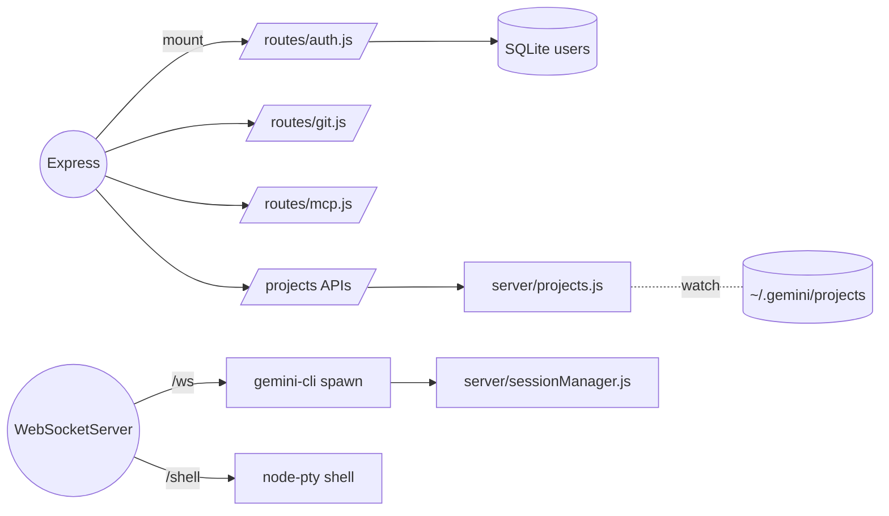

Server Agent Overview (commit 9ef25db @ 2025-08-09T19:38:14-04:00)

Key
- [BP]: Best practices
- [HY]: Hygiene
- [PT]: Patterns
- [TECH]: Tech use

Best practices [BP]
- Split routes: `auth`, `git`, `mcp`; middleware for auth/api-key
- WebSocket handshake auth via JWT
- CORS + JSON middleware configured; static assets after API

Hygiene [HY]
- DB init from `server/database/init.sql` via better-sqlite3
- Logger present (`server/logger.js`) though largely quieted

Patterns [PT]
- Service modules: `projects`, `gemini-cli`, `sessionManager`
- File watcher (chokidar) on `~/.gemini/projects` debounced, WS-broadcasts `projects_updated`
- Git ops via `child_process.exec` wrapped with validation of repo root

Tech use [TECH]
- Express 4, ws, node-pty, better-sqlite3, bcrypt, jsonwebtoken, multer

Mermaid

Improvements for awareness and sync
- Add `/api/version` returning `{ commit, startedAt, port }` sourced from env or `git rev-parse`; cache at startup.
- Replace manual `.env` parsing with `dotenv`; validate required envs (JWT_SECRET in prod, PORT).
- Add path guard middleware for file endpoints to ensure `filePath` is under resolved project root.
- Add ping/pong on WSS and periodic broadcast of project updates health.
- Expose `/api/settings` to persist model and timeout server-side, aligning with UI tools settings.

Multi-engine (Gemini + Cursor) server plan
- Keep .env manual loader; do not introduce dotenv.
- Add `server/ai/runnerFactory.js` returning `{ spawn, abort }` by engine key.
- Implement `server/cursor-cli.js` mirroring `gemini-cli.js` but spawning `cursor` binary; reuse streaming protocol with generic event types (e.g., `ai-response`).
- In `server/index.js` WS chat handler, read `engine` query param or message field and call the runner.
- Emit structured tool events from runners (`{ type: 'tool', name, args, startedAt, endedAt, status }`) to drive ToolUse UI.

Wiring map (selected)
- Entry: `server/index.js` builds `app`, `server`, `wss` with `verifyClient`
- Routes: `authRoutes`, `gitRoutes`, `mcpRoutes` mounted under `/api/...`
- Project/file APIs: list, sessions, messages, read/save file, binary content
- WS: `/ws` for chat to Gemini; `/shell` for interactive PTY
- `gemini-cli.js`: spawns CLI, timeout 30s, accumulates response, persists via `sessionManager`
- `projects.js`: reads `~/.gemini/projects/<encoded>/*.jsonl`, decodes, caches paths; provides rename/delete/add

Anti-patterns and risks
- Path traversal risk on file read/save APIs: enforce path is inside resolved project root [BP]
- JWT secret default; add env-only and expirations [HY]
- `server/routes/git.js` bug: `return res.status(400)... .slice(________);` -> remove `.slice(________)` [PT]
- Manual `.env` parsing; prefer `dotenv` [HY]

Notes
- Ports: API `PORT` env or 4008; Vite proxy targets it
- Static `dist/` served after API routes; wildcard to SPA index

Log
- 2025-08-09 19:38 (-0400, 9ef25db): Synced server agent; added awareness/sync plan; reiterated file path guard and git discard fix.
- 2025-08-09 20:00 (-0400, 9ef25db): Added multi-engine runner plan (Gemini + Cursor) and tool telemetry guidance; no code edits.
