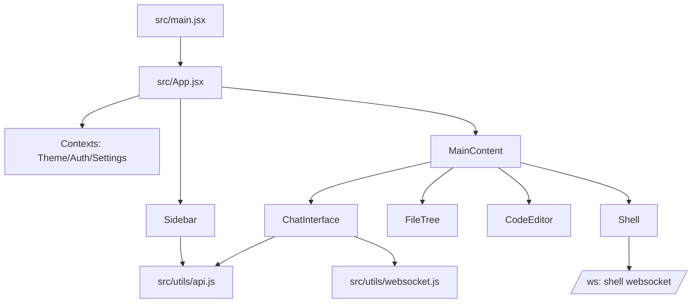

Src Agent Overview (commit 9ef25db @ 2025-08-09T19:38:14-04:00)

Key
- [BP]: Best practices
- [HY]: Hygiene
- [PT]: Patterns
- [TECH]: Tech use

Best practices [BP]
- Context providers (`AuthContext`, `ThemeContext`, `SettingsContext`) wrap app
- Single `api` and `useWebSocket` abstractions
- UI components separated under `components/ui` with `cn` util

Hygiene [HY]
- ESLint React configs active; hooks rules enabled
- Version check hook isolated (`useVersionCheck`)
- Error boundary at root

Patterns [PT]
- Router mounts `AppContent` for `/` and `/session/:id`
- Sidebar/MainContent split; tabbed editors; memoization on heavy components
- Session protection system in `src/App.jsx` prevents WS-driven UI churn by pausing sidebar updates during active chats

Tech use [TECH]
- React 18, Vite 7, Tailwind 4
- Code editors: Monaco and CodeMirror; xterm for shell view

Mermaid

Wiring map (selected)
- `src/main.jsx` renders `App` with `StrictMode`
- `src/App.jsx` sets up providers, routes, session protection, passes WS+API down
- `src/utils/api.js` centralizes REST calls and auth header injection
- `src/utils/websocket.js` fetches `/api/config`, handles reconnect, exposes `sendMessage`
- `src/components/*` implement UI: chat, editors, git, settings, etc.

Anti-patterns and risks
- LocalStorage token without refresh/expiry; add logout-on-401 and refresh logic [BP]
- ReactMarkdown used without explicit sanitization config; ensure untrusted content is safe [HY]
 - Git panel depends on backend error message strings; prefer structured error codes [HY]

Improvements for awareness
- Add `useServerInfo` hook that calls `/api/version` once, caches commit SHA/boot time, and exposes via context so UI can stamp logs and agent docs.
- Extend `useWebSocket` with heartbeat (ping/pong) and backoff; emit status events to `GeminiStatus`.
- Add a small `src/agent/log.ts` module to append entries to a server-backed `/api/agent/log` for unified logs.

Multi-engine (Gemini + Cursor) UI plan
- Add engine selector UI after auth; persist `localStorage: engine` and show in Tools Settings.
- Introduce `src/ai/ProviderFactory.js` with providers `GeminiProvider` and `CursorProvider` sharing `{ send, abort, stream }`.
- Update `useWebSocket` to include `engine` parameter; ChatInterface uses provider methods to send/abort.
- Enhance `ToolUseFeedback.jsx` to show real tool calls `{ name, args, status, duration }` streamed over WS.

Notes
- Many components import `lucide-react`; tree-shaking helps but keep eye on bundle size
 - Docs: `src/GEMINI.md` contains UI-specific notes

API usage map (by component)
- ChatInterface: `api.sessionMessages`, `api.getFiles`
- Sidebar: `api.projects` (via parent), `api.renameProject`, `api.deleteSession`, `api.deleteProject`, `api.createProject`, `api.getSessions`
- FileTree: `api.getFiles`
- NewCodeEditor/CodeEditor: `api.readFile`, `api.saveFile`
- EditorTab: `api.readFile`
- SpecDesign: `api.saveFile`
- GitPanel: `/api/git/*` via `authenticatedFetch`
- MicButton/whisper: `api.transcribe`
- ToolsSettings: localStorage; MCP CLI endpoints stubbed (`/api/mcp/cli/*`)

Auth flow
- `AuthContext` drives login/register/status; `ProtectedRoute` guards app; token persisted in localStorage as `auth-token` and injected by `authenticatedFetch`.

Log
- 2025-08-09 19:38 (-0400, 9ef25db): Synced with full src wiring (Shell, session protection), added awareness improvements.
- 2025-08-09 20:00 (-0400, 9ef25db): Added multi-engine provider plan and tool visibility strategy; guidance only.
